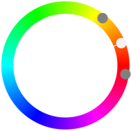

title: Analog 2
secondary_color: analogous2

Mit der Einstellung `analogous2` werden zwei ähnliche Farben (30°) zu `primary_color` dunkler/heller gemischt je nach Ansicht.

{ style="max-width: 50%" }

```markdown
title: Analog 2
secondary_color: analogous2
```
