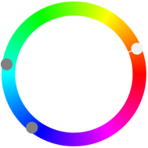

title: Mischung
secondary_color: compound

Mit der Einstellung `compound` werden zwei Farben 150° zu `primary_color` dunkler/heller gemischt je nach Ansicht.

{ style="width: 10%" }

```markdown
title: Mischung
secondary_color: compound
```
