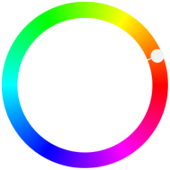

title: Monochromatisch
secondary_color: mono

Mit der Einstellung `mono` (Standard) wird die `primary_color` dunkler/heller gemischt je nach Ansicht.

{ style="max-width: 50%" }

```markdown
title: Monochromatisch
secondary_color: mono
```
