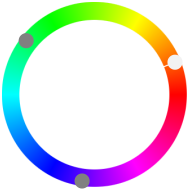

title: Triadisch 2
secondary_color: triadic2

Mit der Einstellung `triadic2` werden zwei Farben 120° zu `primary_color` dunkler/heller gemischt je nach Ansicht.

{ style="width: 10%" }

```markdown
title: Triadisch 2
secondary_color: triadic2
```
